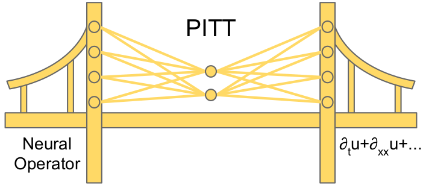

# Physics Informed Token Transformer
Official repository for Physics Informed Token Transformer (PITT)

Data is available [here](https://drive.google.com/drive/folders/1IBVMqBPg3AEjVnXoBM7y0n3NDylGMmY2?usp=sharing).
The provided `pitt.yaml` file can be used to create a new conda environment with: `conda create -f pitt.yaml` (recommended).

This repo is a work in progress.
Currently, training scripts and model files that can be used to recreate results from the paper are included.
Hyperparameter values for each experiment are provided in the appendices of the paper.
Additional functionality to more easily decompose PITT output and analyze attention maps will be available in the future.
GPU is recommended for all training, as CPU training is prohibitively slow.

### Model training
Model specifications are defined using config files in the `configs/` directory.
For training 1D neural operator models, use `train_neural_operator.py` and select either `fno`, `oformer`, or `deeponet` as a command line argument. 
PITT relies on DeepXDE, and so to run scripts it is recommended to use `DDE_BACKEND=pytorch python train_neural_operator.py fno`, for examples.
This script will load `fno.yaml`, `oformer.yaml`, or `deeponet.yaml` to use for model architecture and training hyperparameters.
For training 1D PITT variants, use `train_pitt.py`.
The underlying neural operator is specified in `pitt_config.yaml` using the `neural_operator` argument, including all of the neural operator architecture parameters.
Note: the `base_path` argument must be set to the location of the downloaded data, either as a relative or absolute path.

Training works similarly for 2D models.
The `split_style` argument is currently recommended to only be `initial_condition` for Navier-Stokes data, and `equation` for Poisson data.
Training scripts automatically handle data loading when switching between Navier-Stokes and Electric data, but `num_x` and `num_y` must manually be changed in the config file.
When doing `next_step` style training, `sim_time` must be set to larger than 120 using the provided Navier-Stokes data.
When doing `fixed_future` style trianing, `sim_time` must be smaller than or equal to 120 using the provided Navier-Stokes data.
In that case, `sim_time: 120` uses data at $T=30s$, and `sim_time: 80` uses data at $T=20s$.

Choosing standard vs. novel embedding can be controlled with the `embedding` argument in `pitt_config.yaml` and `2d_pitt_config.yaml`, where `embedding: standard` will use standard positional encoding and lookup table embedding, and `embedding: novel` will use the novel embedding method.


During training, scripts will automatically create the directory specified by the `results_dir` argument and will create a subdirectory for individual model results.
This overwrites existing model results in that path.
Train, validation, and test loss, as well as model files, the config file, and progress plots are saved to this subdirectory.
Additionally, `plot_progress.py` will be copied to the model results directory and allows for easily monitoring progress of ongoing experiments.

Note: `utils.py` corrects and modifies tokenized equations leading to longer loading times.

### Data Generation
1D data can be generated with `python generate_1d_data.py` in the `data_generation` directory.
The script is currently set up to generate 1000 samples for each equation parameter combination.
1D data generation code is adapted from [here](https://github.com/brandstetter-johannes/MP-Neural-PDE-Solvers).

### Preprint
The arXiv preprint is available [here](https://arxiv.org/abs/2305.08757).
If you use this code or any of the ideas from PITT, please cite as:
```
@misc{lorsung2023physics,
      title={Physics Informed Token Transformer}, 
      author={Cooper Lorsung and Zijie Li and Amir Barati Farimani},
      year={2023},
      eprint={2305.08757},
      archivePrefix={arXiv},
      primaryClass={cs.LG}
}
```
PITT is currently in submission at the Journal for Computational Physics.
The full paper will be available upon publication and release.

